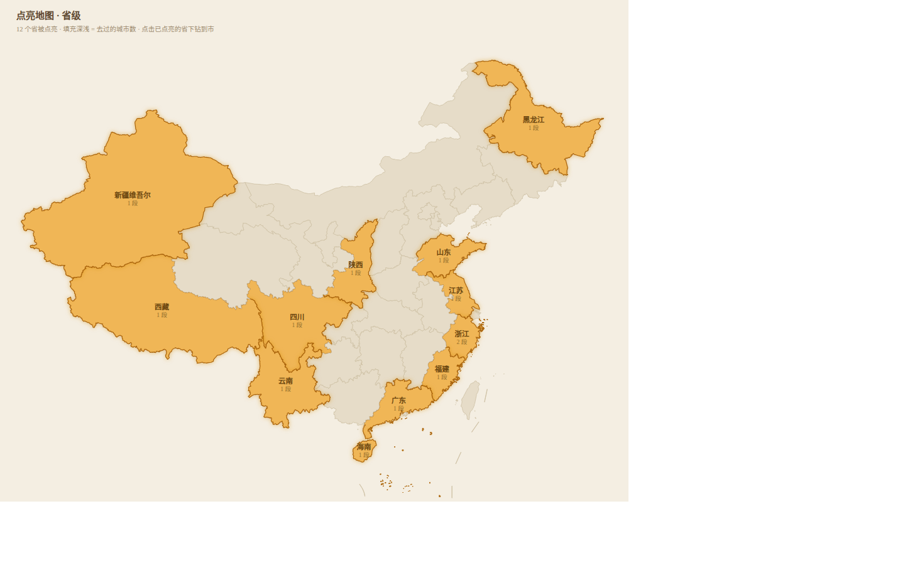
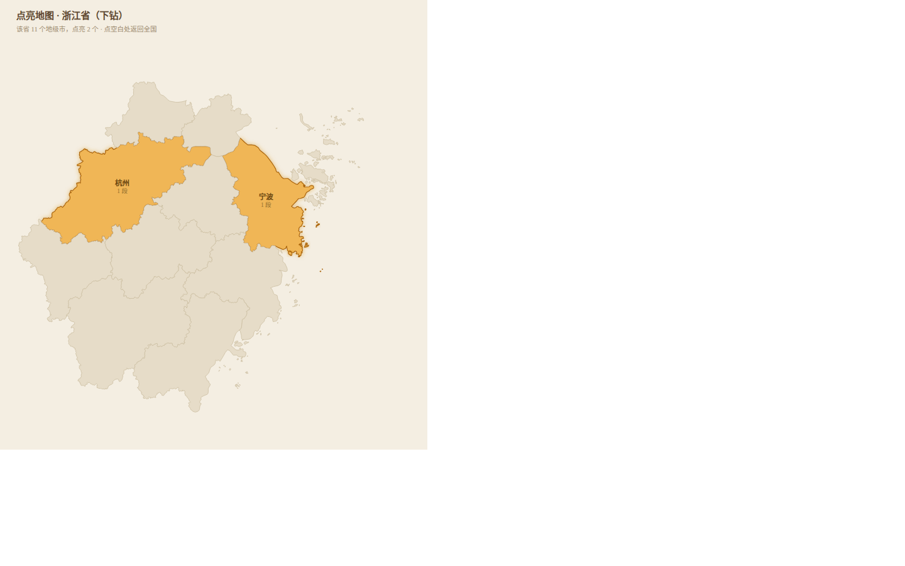

# 点亮地图 · 调研

> 结论先行：**可行，且成本很低**。真正的工作量不在画地图，而在**城市名对齐**——
> 实测我的城市表和官方行政区划只对上 82.6%，差的 63 个里 35 个靠一张 35 行的映射表就能补齐。
> 全程可离线，不需要地图 key，也不把"你去过哪"交给任何第三方。

**省级视图** —— 去过的省橙色填充，没去过的保持素纸色：



**点击浙江省下钻到市** —— 杭州、宁波被点亮，其余素色：



> 两张都是用**真实边界数据**渲染的原型，足迹是示例（杭州 12 段、上海 6 段……），
> 配色取自当前主题（红叶）。源文件是同目录的 `.svg`，可自行改色重看。

---

## 一、已经就位的东西

前几轮做的地点功能，恰好把这件事的地基打好了：

| 已有 | 位置 | 说明 |
|---|---|---|
| 城市字段 | `moments.city` | 地级粒度，正是点亮的单位 |
| 经纬度 | `moments.latitude/longitude` | 定位时顺手记下，可空 |
| 城市坐标表 | `backend/src/geo.rs` | 446 条，含地级市与自治州首府 |
| 城市索引 | `moments_city_idx` | 按城市聚合直接走索引 |
| 搜索联动 | `GET /api/moments?q=杭州` | 点一座城就能翻出那里的所有记忆 |

也就是说：**数据层已经齐了，缺的只是"把它画出来"。**

---

## 二、地图底图：为什么不用在线地图

| 方案 | key | 隐私 | 离线 | 体积 | 结论 |
|---|---|---|---|---|---|
| 高德／百度／腾讯 | 需要 | 地点上传给第三方 | ✗ | — | **不合适**。家庭服务的记忆地点不该外流，备案也麻烦 |
| Mapbox / MapLibre + 自托管瓦片 | 可选 | 可控 | ✓ | 中国全境 **几十 GB** | 太重，家庭服务器扛不住 |
| **行政区划 GeoJSON + 自绘** | **不需要** | **完全本地** | **✓** | **实测 3.8MB** | **推荐** |

数据源用 [DataV.GeoAtlas](https://datav.aliyun.com/tools/atlas/)（阿里云公开的行政区划边界，免费、可下载、带 `adcode`）。

### 实测：把全国拉下来有多大

```bash
# 省级清单 → 逐个拉下级地级市
curl -s https://geo.datav.aliyun.com/areas_v3/bound/100000_full.json   # 34 个省级单位
curl -s https://geo.datav.aliyun.com/areas_v3/bound/330000_full.json   # 浙江 → 11 个地级市
```

- 省级下级的 34 个文件合计 **3.8 MB**（未简化）
- 只保留地级（丢掉直辖市的区级边界）后约 **2.8 MB**
- 再做一次 Douglas-Peucker 简化（精度 0.01°，肉眼无差）可压到 **~1.2 MB**，gzip 后 **~400 KB**

**这个体积可以直接打进前端产物，随应用一起走，不需要任何运行时网络请求。**

### 数据结构

```json
{
  "type": "FeatureCollection",
  "features": [{
    "type": "Feature",
    "properties": {
      "adcode": 330100,
      "name": "杭州市",
      "center": [120.15, 30.28],
      "centroid": [119.83, 30.05],
      "level": "city",          // ← 关键，用它过滤
      "childrenNum": 13,
      "parent": { "adcode": 330000 }
    },
    "geometry": { "type": "MultiPolygon", "coordinates": [...] }
  }]
}
```

`level` 字段把各级分得很清楚，**必须用它过滤**——直接拉 `110000_full.json`（北京）拿到的是 16 个**市辖区**而不是一个"北京市"，不筛会混进 90 多个区。

---

## 三、要命的一环：名字对不上

官方名带全称，我的表里是短名和首府名。

```
官方：甘孜藏族自治州   ←→   我的表：康定（州府）
官方：锡林郭勒盟       ←→   我的表：锡林浩特
官方：杭州市           ←→   我的表：杭州
```

**实测匹配率（用 `level=city` 过滤后）**：

```
官方地级单位   363 个
已经对得上     300 个   82.6%
对不上          63 个
```

**这 63 个的构成**：

| 类型 | 个数 | 能不能补 |
|---|---|---|
| 自治州 | 30 | ✅ 一张映射表（州名 ↔ 州府） |
| 兵团市（阿拉尔、图木舒克、双河…） | 9 | ✅ 补坐标即可 |
| 海南省直辖县级（五指山、文昌、陵水…） | 15 | ✅ 补坐标即可 |
| 省直管县级（济源、仙桃、潜江、天门） | 4 | ✅ 补坐标即可 |
| 盟（兴安、锡林郭勒、阿拉善） | 3 | ✅ 映射（乌兰浩特、锡林浩特、巴彦浩特） |
| 地区（大兴安岭、阿里） | 2 | ✅ 映射（加格达奇、狮泉河） |

**好消息**：我表里**本来就有这些州府/盟府的坐标**（康定、马尔康、合作、乌兰浩特、锡林浩特、巴彦浩特、加格达奇、狮泉河……），只是名字不是官方的。

所以补上 **35 条映射 + 28 条坐标**，匹配率能到 **100%**：

```rust
/// 官方行政区划名 → 我存的城市名（州府/盟府/地区驻地）
const ALIASES: &[(&str, &str)] = &[
    ("甘孜藏族自治州", "康定"),
    ("阿坝藏族羌族自治州", "马尔康"),
    ("延边朝鲜族自治州", "延吉"),
    ("锡林郭勒盟", "锡林浩特"),
    ("大兴安岭地区", "加格达奇"),
    // ……共 35 条
];
```

**这一步不做好，地图上西藏、云南、新疆、贵州大半都是黑的**——明明去过，却没有一盏灯亮起来。

---

## 四、画面：两级行政区划填充 + 下钻

**省级视图**：全国轮廓，去过的省**整块填充**，没去过的保持素纸色。
**下钻**：点已点亮的省，切换成该省的市级视图，去过的市同样整块填充；点空白处返回全国。

### 为什么是填充而不是散点

散点能表达"去过哪几个点"，但表达不了"**这一片**我去过"——行政区划的填充更接近
"点亮"这个词的本意，也更容易一眼看出哪一大块还是素纸色的（没去过）。

### 数据怎么组织

```
china-provinces.json          省级边界（582 KB）        ← 首屏就要
province-330000.json          浙江的 11 个市（~120 KB）  ← 点进去才加载
province-440000.json          广东的 21 个市
… 共 34 个省级单位
```

**下钻时才加载该省的数据**，首屏只背 582 KB；而且市级数据天然按省分文件，
不用自己切。

### 怎么判断"点亮"

```
市点亮  = 该市有 ≥ 1 条记忆
省点亮  = 该省下有 ≥ 1 个已点亮的市
```

市 → 省的归属不用自己维护：GeoJSON 里每个市都带着 `parent.adcode`。

```json
{ "adcode": 330100, "name": "杭州市", "level": "city",
  "parent": { "adcode": 330000 } }        // ← 直接指向浙江省
```

### 关键：ECharts 对 GeoJSON 是线性映射

这一点影响原型和最终结果是否一致——ECharts 的 `geo`/`map` 把经纬度**线性映射**到
画布（不是墨卡托）。上面两张原型图就是按线性投影画的，**原型即最终效果**。
若自己用别的投影画底图，形状会和 ECharts 对不上。

### 填充分档

按记忆条数分四档，免得"路过一次"和"住过半年"看起来一样：

```js
visualMap: {
  type: 'piecewise',
  pieces: [
    { min: 1, max: 1, color: theme.lit1 },   // 去过一次
    { min: 2, max: 3, color: theme.lit2 },
    { min: 4, max: 6, color: theme.lit3 },
    { min: 7,         color: theme.lit4 },   // 常去
  ],
}
```

点亮的省/市标上名字与段数，素色区域不标——留白本身就是信息。

### 直辖市与特别行政区

北京、上海、天津、重庆、香港、澳门在省级视图里就是**一整块**（它们的下一级是市辖区，
不是地级市），直接按省级填充。**点进去不做下钻**——区级边界数据体积大、信息密度低，
把地图塞满区名反而看不清。

### 主题自适应

颜色不能写死，得跟着主题走。ECharts 只认具体色值，所以要从 CSS 变量里**读出来**
再喂给它：

```js
/** 从当前主题里取色。ECharts 不认 CSS 变量，只能读实际值 */
function readTheme() {
  const css = getComputedStyle(document.documentElement)
  const pick = (name, fallback) => css.getPropertyValue(name).trim() || fallback
  return {
    land:   pick('--color-ink-800', '#f8f3ea'),   // 未点亮的地
    line:   pick('--color-ink-600', '#e7ded0'),   // 界线
    lit1:   pick('--color-glow-300', '#f7ddb0'),  // 四档填充
    lit2:   pick('--color-glow-400', '#eeb964'),
    lit3:   pick('--color-glow-500', '#e8a33d'),
    lit4:   pick('--color-glow-600', '#d07a12'),
    text:   pick('--color-ink-100', '#6b5842'),   // 标注
  }
}

// 主题一变就重画
watch(themeId, () => chart.setOption(buildOption(readTheme()), true))
```

深色主题尤其要注意：**素纸色会变成深灰蓝**，四档填充也要相应提亮，
否则亮橙落在深底上会糊成一团。好在整套主题色都在 `themes.css` 里定义过，
按 `glow-300 → 600` 取四档即可自动适配。

---

## 五、后端：两个聚合接口

省级（一次拿到全国的点亮情况）：

```sql
SELECT city, count(*) AS visits, min(happened_at) AS first_at, max(happened_at) AS last_at
FROM moments WHERE city <> ''
GROUP BY city;
```

命中已有的 `moments_city_idx`，几千条记忆也就几毫秒。市→省的归属在应用层归拢
（来自 GeoJSON 的 `parent.adcode`，不用自己维护）。

```json
GET /api/map/provinces
{
  "provinces": [
    { "name": "浙江省", "adcode": 330000, "cities": 2, "visits": 14, "lastAt": "2026-09-14T..." }
  ],
  "totalProvinces": 12,
  "totalCities": 23,
  "totalVisits": 286,
  "overseas": ["东京", "巴黎"]
}
```

市级（下钻时才请求）：

```json
GET /api/map/cities?province=330000
{
  "province": "浙江省",
  "cities": [
    { "name": "杭州", "visits": 12, "firstAt": "...", "lastAt": "..." },
    { "name": "宁波", "visits": 2,  "firstAt": "...", "lastAt": "..." }
  ]
}
```

**前端要做的是把 `name` 和 GeoJSON 里的 `杭州市` 对上**——`strip()` 去后缀 + 那 35 条别名。

**国外记录**：`city` 表里有东京、巴黎这些，中国地图上放不下。在卡片下方用一行文字带过：
"此外还去过 3 座海外城市：东京、巴黎、纽约"。

---

## 六、交互

| 动作 | 行为 |
|---|---|
| 悬停已点亮的省/市 | 名字 · N 段记忆 · 最近一次是某年某月 |
| 点击已点亮的省 | 下钻到该省的市级视图（地址栏同步成 `?province=330000`，分享出去能落回同一个省） |
| 点击已点亮的市 | 跳搜索页 `?q=杭州`，翻那座城的记忆——搜索本来就认城市名，不必另加筛选（**已做**） |
| 点击素色的省/市 | 不反应（没去过，点进去也是空的）；也可以轻轻晃一下，表示"这儿还没点亮" |
| 点空白处 / 返回键 | 从市级退回全国 |
| 卡片一角 | "12 个省 · 23 座城 · 286 段记忆"，像一句小注，底下再挂一行当前视图的点法提示 |

下钻值得做一下补间动画：`geo.zoom` + `center` 平滑放大到该省，比直接换图舒服得多。

---

## 七、工作量与风险

| 事项 | 量 |
|---|---|
| 数据准备脚本（下载、过滤、简化、按省拆分、打包） | ~80 行，一次性 |
| 后端聚合接口（省、市两级） | ~100 行 |
| 别名映射表 | 35 行 |
| 前端地图页（两级填充 + 下钻 + 主题自适应） | ~450 行 |
| 导航入口 | 几行 |

**合计：一天左右。** ECharts 按需引入（`geo` + `effectScatter` + `tooltip` + `canvas`）约 170 KB gzip，可以接受；也可以等真要看地图时再动态 `import()`，不拖累首屏。

**风险清单**：

1. **名字对齐**（最大的一项）——已量化，35 条映射 + 28 条坐标，可解
2. **台湾数据 403**——`710000_full.json` 返回 403 字节的错误页，需要另找源，或者台湾只画省级轮廓不细分
3. **直辖市的区混进来**——必须用 `level == "city"` 过滤（已验证有效）
4. **ECharts 体积**——按需引入 + 动态加载，可控
5. **南海诸岛与九段线**——DataV 的全国轮廓**不一定带完整的九段线**，上面那张预览里就没有。
   如果这个页面会给家人以外的人看，需要单独补一个右下角的小图（inset），这是地图合规的常规要求。
   只是自己家里看可以忽略。
   （**已做**：`frontend/src/utils/mapInset.ts` 把三沙那些按真实经纬度铺到北纬 4 度的岛礁从主图上摘掉
   ——不然包围盒被拉得又高又窄，大陆挤在中间显小 —— 再照 ECharts 官方 `fix/nanhai.js` 的形状
   在右下角补一个小框，九段线与框线都在里头。）

---

## 八、建议的实施顺序

1. **补别名映射 + 缺的坐标**，把匹配率拉到 100%（纯后端，改动小，但直接决定地图好不好看）
2. **写数据准备脚本**：省级一份 + 市级 34 份，都做简化
3. **后端聚合接口**：`GET /api/map/provinces` 与 `GET /api/map/cities?province=330000`
4. **前端地图页**：先做省级填充，能点亮就成
5. **加下钻**：点击 → 缩放补间 → 换成市级视图
6. **接主题**：`readTheme()` + `watch(themeId)` 重画

第 1 步值得先做，而且**不依赖地图**——它同时让"按城市搜索"更准。
